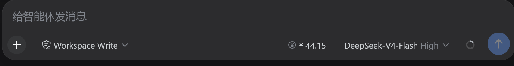
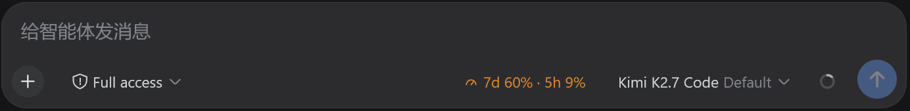
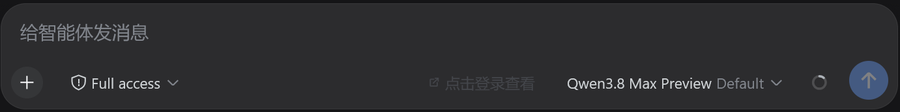
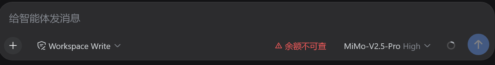

# dsh-model-balance

[](https://www.npmjs.com/package/dsh-model-balance)
[](LICENSE)

[中文](README.md) | English

Multi-provider **real account balance** display for the [DeepSeek Harness](https://github.com/deepseek-ai/deepseek-harness) Web GUI.

Shows a balance pill **in front of the model selector** in the composer. Switch models → instantly see that provider's balance. Every usage change triggers a refresh.

## Currently Supported Providers

| Provider | API Endpoint | Data | Status |
|----------|-------------|------|--------|
| **DeepSeek** | `GET /user/balance` | Account balance (¥) | ✅ Official API |
| **StepFun** | `GET /v1/accounts` | Account balance (¥) | ✅ Official API |
| **Kimi Coding** | `GET /v1/usages` | Quota (7-day + 5-hour) | ✅ Official API |
| **OpenRouter** | `GET /api/v1/auth/key` | Credit balance ($) | ✅ Official API |
| **MiniMax** | `GET /v1/token_plan/remains` | Remaining quota | ✅ Official API |
| **xAI / Grok** | `GET /v1/dashboard/billing/credit_grants` | Credit balance ($) | ✅ Official API |
| **Qwen Token Plan** | Bailian console | Login to view | 🔗 Login required |
| **Xiaomi MiMo** | Xiaomi platform console | Login to view | 🔗 Login required |
| Mistral, Groq, Cohere, … | — | — | ⚠️ Not supported |

> **Adding a new provider?** Two ways:
> 1. **Config file** (recommended): Edit `providers.json` in plugin directory or create `~/.dsh/model-balance-providers.json`
> 2. **Submit PR**: See [`src/host/strategies.ts`](src/host/strategies.ts) — add a parser + strategy entry

## Display States

The pill renders four states depending on the provider type:

<table>
  <tr align="center">
    <td width="50%"><br><b>Currency balance</b></td>
    <td width="50%"><br><b>Quota percentage</b></td>
  </tr>
  <tr align="center">
    <td><br><b>Login to view</b></td>
    <td><br><b>Not supported</b></td>
  </tr>
</table>

- **Currency balance**: DeepSeek, StepFun, OpenRouter, xAI, etc. show the account balance directly (click to refresh).
- **Quota percentage**: Kimi Coding shows both the 7-day weekly quota and the 5-hour rate-limit as remaining percentages (hover for request counts and reset time).
- **Login to view**: Qwen (Bailian Token Plan) and Xiaomi MiMo have no API balance endpoint — clicking opens the console in a **new page**.
- **Not supported**: providers with neither an API endpoint nor a public console entry.

## How It Works

```
┌─────────┐    GET /model-balance/query    ┌──────────┐   Bearer API key    ┌──────────────┐
│  Browser │ ──────────────────────────────→│ DSH Host │ ──────────────────→│ Provider API │
│  (pill)  │←──────────────────────────────│  (route) │←──────────────────│  (real data) │
└─────────┘    JSON envelope               └──────────┘   balance/quota    └──────────────┘
```

- **Browser**: renders the pill, triggers queries on model switch / turn end / periodic poll / click
- **Host route** (`/model-balance/query`): resolves the provider's credential from DSH Credentials, queries the billing API, caches results (60s success / 15s error)
- **No credentials leak**: API keys never reach the browser

## Install

```bash
# Via npm
npx @deepseek-ai/dsh plugin --profile web add dsh-model-balance

# From GitHub
npx @deepseek-ai/dsh plugin --profile web add github:nabin-qq273274877/dsh-model-balance

# Local development (link)
npx @deepseek-ai/dsh plugin --profile web add link:/path/to/dsh-model-balance
```

Or copy this prompt to AI:

```
Please install the dsh-model-balance plugin for me. Repository: https://github.com/nabin-qq273274877/dsh-model-balance
Follow the README instructions for installation and configuration.
```

Then restart `dsh web` and refresh.

## Uninstall

```bash
npx @deepseek-ai/dsh plugin --profile web remove dsh-model-balance
```

## Custom Providers

The plugin includes a `providers.json` with all supported providers. You can:

1. **Edit** the `providers.json` in the plugin directory directly
2. **Or create** `~/.dsh/model-balance-providers.json` (higher priority, overrides same-name providers)

Config file format:

```json
{
  "providers": {
    "your-provider": {
      "name": "Display Name",
      "baseURL": "https://api.example.com",
      "endpoint": "/v1/balance",
      "keyEnv": "YOUR_API_KEY",
      "response": {
        "type": "currency",
        "currency": "USD",
        "balancePath": "data.balance"
      }
    }
  }
}
```

**Field reference**:

| Field | Required | Description |
|-------|----------|-------------|
| `name` | No | Display name |
| `baseURL` | Yes | API base URL |
| `endpoint` | Yes | Balance endpoint path |
| `keyEnv` | Yes | Environment variable name for the API key |
| `response.type` | Yes | `currency` (balance) or `quota` (request count) |
| `response.currency` | No | Currency code, default `"CNY"` |
| `response.balancePath` | Yes* | JSON path, e.g. `"data.balance"` |
| `response.limitPath` | Yes* | JSON path for quota limit |
| `response.usedPath` | Yes* | JSON path for used quota |
| `response.remainingPath` | Yes* | JSON path for remaining quota |
| `aliases` | No | List of alias provider IDs |

Restart `dsh web` after modifying the config.

## Refresh Strategy

| Trigger | Bypass Cache | Description |
|---------|-------------|-------------|
| Model switch | No | Query new provider's balance (host cache OK) |
| Turn end | **Yes** | Usage just changed, force fresh data |
| Periodic poll | No | Every 2 minutes while tab is visible |
| Click pill | **Yes** | Manual force-refresh |

## Development

```bash
git clone https://github.com/nabin-qq273274877/dsh-model-balance.git
cd dsh-model-balance
pnpm install
pnpm run build
pnpm test

# Link into your DSH profile for live testing
npx @deepseek-ai/dsh plugin --profile web add link:$(pwd)
```

## Architecture

```
src/
├── types.ts              # Shared type definitions
├── host/
│   ├── index.ts          # Host plugin: route registration + caching
│   └── strategies.ts     # Strategy registry + URL matching + parsers
└── client/
    └── index.ts          # Client plugin: BalancePill component + locales

scripts/
└── build.ts              # esbuild: host ESM + client factory bundle

docs/
└── images/               # README screenshots

test/
└── strategies.test.ts    # Unit tests for matching + parsing
```

## License

[MIT](LICENSE)
